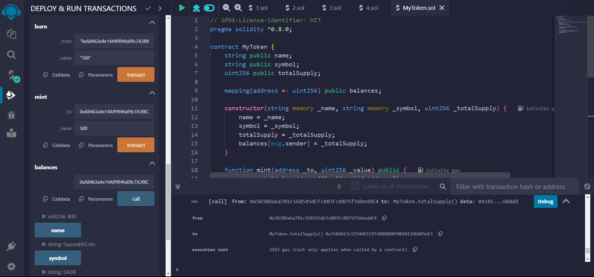

# MetaCrafter-Summer2024
MetaCrafter Course for Blockchain Development

# SaurabhCoin-My Own first digital Coin

SaurabhCoin is a fun and light-hearted cryptocurrency token that brings joy and laughter to its users.

## Description

SaurabhCoin is a digital currency built on the Ethereum blockchain. my aims was to learn various transactions and interactions.SaurabhCoin is here to brighten your day.

## Getting Started

### Screenshot

### Installing

* Download the source code from [GitHub](https://github.com/saurabhkr78/MetaCrafter-Summer2024.git) or clone the repository: git clone https://github.com/saurabhkr78/MetaCrafter-Summer2024.git

No additional modifications are needed to the files or folders.

## Executing program
1.Navigate to the project directory.  
2.Compile the Solidity contract using a tool like Remix.  
3.Deploy the contract on the Ethereum blockchain.  
4.Interact with the contract using MetaMask.  

### Step-by-step:
1.Open Remix.  
2.Create a new file and paste the Solidity contract code.  
3.Compile the contract.  
4.Deploy the contract using the "Deploy & Run Transactions" tab.

## Help
contact:meetsaurabh78@gmail.com

## Authors
Contributors names and contact info

Saurabh Kumar  
X:@saurabhkr78  
Linkdin:https://www.linkedin.com/in/saurabhkr78/

## License
This project is licensed under the MIT License
